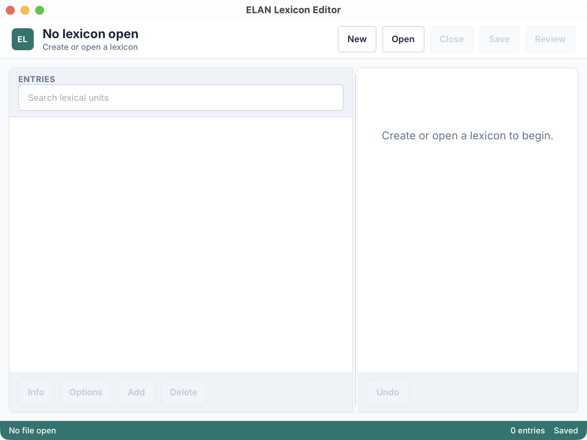

# ELAN Lexicon Editor

Desktop editor for creating, reviewing, and saving XML lexicon files that follow the ELAN lexicon schema. It lets you work directly with lexicon files without opening ELAN itself or an associated transcription file.

The app is built with Tauri 2, a Rust backend, and a lightweight vanilla TypeScript/DOM front end, so it should remain practical on older machines.



## Why this app?

This app is designed to reduce the friction in the lexicon-editing and interlinearization workflow with ELAN, especially in collaborative projects. Instead of creating/maintaining a separate document in another program (e.g. SIL Toolbox or FLEx) and importing it back and forth, you can edit the lexicon XML directly. While ELAN has a built-in lexicon editor, it is not a standalone app, and does not fare well with version-controlled, collaborative workflows. This app interacts with the native XML format following ELAN's lexicon schema.

Here are the main quality-of-life improvements:

- Lightweight, standalone desktop app that can run on old hardware, with a modern and clean UI;
- Highly consistent cross-platform behavior and UI, and potential for quick iterative development without having to build separately for each platform;
- Built-in semantic diff for human-friendly version control and change tracking, especially if the file is stored in a git repo.

ELAN is designed to work with a "managed" lexicon file. It stores the lexicon file in a hidden directory in the file system. This is in principle not designed for collaborative editing, since edits to the copy managed by ELAN will not automatically propagate to the original file.

To mimic a "referenced" lexicon, you need to store the lexicon file elsewhere (e.g. in a shared git repo) and create a symbolic link to it in the hidden directory, which tricks ELAN into thinking that it is managed. This is undocumented in the ELAN manual, but works fine in the maintainer's tests.

## Features

- Split-pane UI: sortable lexicon table + entry editor with multi-sense support
- Custom lexical sort order (header `sort-order` tokens)
- Custom fields at entry/sense level (`custom-fields.field-spec`)
- Semantic change tracking against disk or git `HEAD`, useful when lexicon files live in a git repository
- XML round-trip with stable child ordering and forced array fields

## Prerequisites

- Node.js 18+ (tested with Node 20)
- Rust stable toolchain with Cargo

## Getting Started

```bash
npm install

# Front-end only (Vite):
npm run dev

# Full app with Tauri backend:
npm run tauri dev
```

- The front-end entry point is `ui/src/main.ts`; backend command wiring starts in `src-tauri/src/main.rs`.

## Build and Package

```bash
# Type-check and build UI assets to dist/
npm run build

# Build native bundles (outputs under src-tauri/target/release/bundle)
npm run tauri build
```

Release packaging is currently focused on macOS and Windows desktop bundles.

## Testing

```bash
cargo test -p app   # Runs Rust tests (XML utilities, etc.)
```

## Project Structure (key paths)

- `ui/src/main.ts` — wires modules, tracks `currentLexicon/currentFilePath/isModified`, invokes backend commands
- `ui/src/LexiconTable.ts` — table rendering, sorting, display options
- `ui/src/EntryEditor.ts` — entry/sense editing, custom fields, autocomplete
- `ui/src/DiffViewer.ts` — diff UI + restore/delete actions
- `ui/src/ConfigDialog.ts` — header metadata and custom field specs
- `src-tauri/src/lexicon/` — internal lexicon core boundary for XML parse/build, normalization, diffing, and lightweight validation
- `src-tauri/src/source.rs` — app-local disk/git/working-object lexicon source resolution

## CI

- Workflow: `.github/workflows/build-binaries.yml`
  - Trigger: manual or tags `v*`
  - Builds Tauri bundles for macOS Apple Silicon, macOS Intel, and Windows
  - Uploads artifacts from the platform-specific `src-tauri/target/<target>/release/bundle` directories

## Data Notice

This repository intentionally does not include real lexicon data. The app can
create a blank ELAN-compatible lexicon directly, and you can open your own
ELAN-compatible lexicon XML files.

## AI Assistance

The maintainer designed the app behavior and UI direction, reviewed the code, tested the app, and is responsible for the final design decisions and releases. Coding assistance was provided by AI tools including Cursor, Claude, Antigravity, and OpenAI Codex at various stages.

The app comes with no warranty. Back up your data and use it at your own risk.

## License

MIT. See `LICENSE`.
